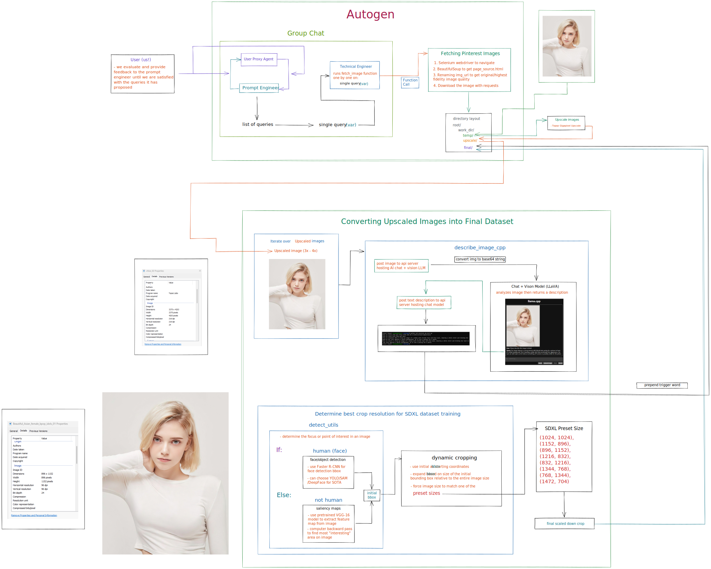

# Autogen and Local LLMs

This is a repository featured in the YouTube video here:

## Overview
The objective of this project is to autonomously fetch images from Pinterest, then use a combination of local large language models to describe images and prepare corresponding captions. The resulting tagged dataset will be used to train an SDXL model.

## Flowchart


## Model Links
**llava-v1.5-7b** (for llama.cpp use):
```
https://huggingface.co/mys/ggml_llava-v1.5-7b
```

**Mistral-7B-Instruct-v0.1-GGUF** (for text-generation-webui use)
```
https://huggingface.co/TheBloke/Mistral-7B-Instruct-v0.1-GGUF
```

**llava-v1.5-13B-GPTQ** (for text-generation-webui use, but not used in final pipeline)

```
https://huggingface.co/TheBloke/llava-v1.5-13B-GPTQ
```

### How to use
There are two different entrypoints you can hook into.

If you are starting from scratch with no images, use the `autogen_app.py` file.
This will start up the Autogen AI agents and prepare an image dataset for you. You can change the save directory name in the `.env` file under the variable `WORK_DIR`.

The second entrypoint is for people that already have an upscaled image dataset. If this is your use case, you can start from the `iterate_dir.py` file. This will iterate over your `WORK_DIR` and describe all your images. The folder structure needs to be like so:

```
/
  /WORK_DIR
    /DIR_NAME
      IMAGES  
```

### Environment Variables Setup
In the `.env`, you must properly set up the API endpoints for your multimodal chat + vision model and your text instruct model.

### OAI_CONFIG_LIST.json
You must add your OpenAI API key if you want to use Autogen. This is where you choose your model as well. Currently, only OpenAI API supports function calls. I hope this will change soon.

### Activating text-generation-webui environment
```
conda activate C:\home\text-generation-webui\installer_files\env
```

### Starting up text-generation-webui with Mistral
```
python server.py --model C:\home\text-generation-webui\models\mistral-7b-instruct\ --extensions openai --listen --loader llama.cpp
```

### Starting up text-generation-webui with LLaVA 1.5
```
python server.py --model C:\home\text-generation-webui\models\llava-v1.5-13B-GPTQ\ --multimodal-pipeline llava-v1.5-13b --api --extensions multimodal --disable_exllama --loader autogptq --listen
```

### Starting up LLaMA CPP
```
./server -t 4 -c 4096 -ngl 50 -m models/llava/ggml-model-q4_k.gguf --host 0.0.0.0 --port 8081 --mmproj models/llava/mmproj-model-f16.gguf
```


### Miscellaneous
I've added in two test codes here. The first is `test_selenium.py`. If this doesn't run properly, that means your Chrome webdriver is not working properly.

The second test code is `pinterest_utils_single.py`. This is a basic file that will fetch images from pinterest for you.

#### Disclaimer
Images/processes may be fabricated and therefore not real. I am unaware of any illegal activities. Documentation will not be taken as admission of guilt.